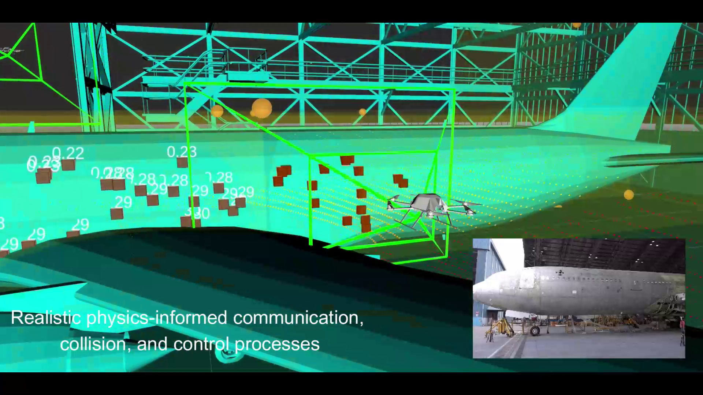

# Cooperative Aerial Robots Inspection Challenge

## Goal

Thanks to their unique mobility, aerial robots have become widely adopted for inspection tasks. We believe that the next breakthrough in this industry shall be delivered by Cooperative Aerial Robots Inspection (CARI) systems. Moreover, in the same spirit of economic specialization, heterogeneous CARI systems has the potential to acheive greater efficiency, quality and versatility compared to single-UAV or homogenous systems.
Nevertheless, to accomplish this vision, novel cooperative strategies that can optimally coordinate the operation of multiple robots remain an open research problem.

To accelerate this development, we introduce the **C**ooperative **A**erial **R**obots **I**nspection **C**hallenge (CARIC) Benchmark, a software stack based on [Gazebo](https://gazebosim.org/home), [RotorS](https://github.com/ethz-asl/rotors_simulator/wiki) and other open-source packages. The objective of CARIC is twofold. First, it aims to faithfully simulate multi-UAV systems operating in typical real-world inspection missions. Second, based on this tool, different cooperative inspection schemes can be benchmarked based on a common metric. The software stack is made public to benefit the community and we would like to welcome all who are interested to participate in the challenge to be held at [CDC 2023, Singapore](https://cdc2023.ieeecss.org/).

For the problem description and other technical details of the CARIC software stack, please visit the project's website at [https://ntu-aris.github.io/caric/](https://ntu-aris.github.io/caric/)

    <a href="https://youtu.be/hB1CvVa50wM" target="_blank">
    
    <figcaption>CARIC @ CDC2023-Singapore</figcaption>

      
## Organizers

* **Thien-Minh Nguyen**, School of EEE, Nanyang Technological University, Singapore.
* **Muqing Cao**, School of EEE, Nanyang Technological University, Singapore.
* **Shenghai Yuan**, School of EEE, Nanyang Technological University, Singapore.
* **Lihua Xie**, School of EEE, Nanyang Technological University, Singapore.
* **Benmei Chen**, Department of MAE, Chinese University of Hong Kong.

  
  

## Procedure

* All participants must sign up via the following [form](https://docs.google.com/forms/d/e/1FAIpQLSfpaBQUJmdi6etYXH5t0bj7R-TWuU_11-lUlEfKzcUrz9Cdyw/viewform) by **17 November 2023**. The latest news and updates will be sent via the registered emails.
* Participants can install the CARIC stack by following the instructions at CARIC's [website](https://ntu-aris.github.io/caric).
* Participants can develop new CARI schemes in python, C++ or docker executable. The proposed CARI scheme should follow the [ground rules](https://ntu-aris.github.io/caric/#61-ground-rules).
* Send your final code / executable to Dr. Thien-Minh Nguyen via **thienminh.npn@ieee.org** by **24 November 2023** for evaluation.
* The submitted method will be evaluated with the same scenarios included in the package, however the following parameters will be altered:
  * The units' starting positions.
  * The bounding box descriptions.
  * The interest points.
  * The mission time.
* The methods will be ranked based on the **total mission scores obtained in all three scenarios**.
* Results will be announced and prize will be presented at CDC 2023.

## Contacts

Please contact **Dr. Thien-Minh Nguyen** via email thienminh.npn@ieee.org for general inquiries.

## Technical inquiries and FAQ

If you have a technical inquiry on the software stack, please check out for reported issues or raise a new one at CARIC's [github repository](https://github.com/ntu-aris/caric/issues).
